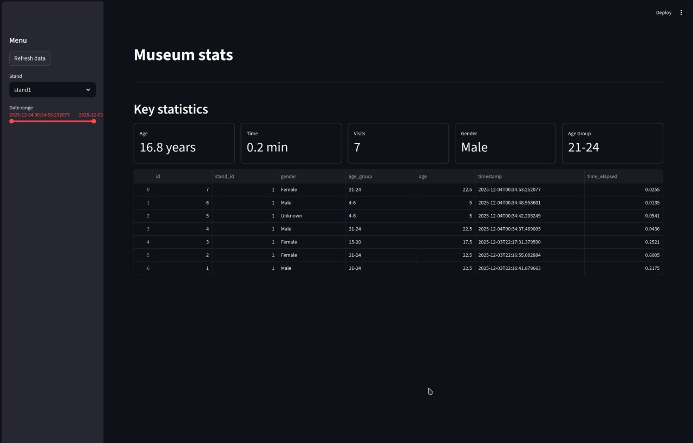

# Модуль интерактивного выставочного стенда (Interactive Exhibition Stand Module)  

Интерактивная система для музеев и выставок, которая по видеопотоку с камеры замечает посетителя у стенда, определяет его демографический профиль (возрастная группа, пол), измеряет время у экспоната, запускает персонализированный сценарий и отправляет данные в хранилище и дашборд для аналитики.

Пример дашборда:  



## Возможности  
- Детекция человека у стенда по YOLOv8 Pose.
- Оценка расстояния до посетителя и активация стенда при приближении/замедлении шага.
- Определение возраста и пола по лицу (OpenCV DNN, предобученные модели).
- Подсчёт времени, проведённого у стенда.
- Отправка событий в сервис хранения и визуализация статистики в дашборде.
- Настройка сценариев работы стенда через JSON‑профиль.

## Требования  
- Python 3.10+ 
- Установленный uv (менеджер окружений и зависимостей для Python).
- Веб‑камера, доступная ОС.

## Структура репозитория  
```
MuseumAssistant/
├── dashboard/
│   ├── docker/
│   ├── src/
│   │   └── app.py              # Streamlit‑дашборд
│   ├── pyproject.toml          # зависимости дашборда (uv)
│   └── uv.lock
├── stand/
│   ├── docker/
│   ├── src/
│   │   ├── main.py             # основной цикл стенда
│   │   ├── distance_detector/
│   │   │   ├── __init__.py
│   │   │   ├── detector.py     # YOLOv8 Pose, дистанция до человека
│   │   │   └── main.py         # отдельный пример использования
│   │   └── demographics_detector/
│   │       ├── __init__.py
│   │       └── detector.py     # определение лица, возраста и пола
│   ├── pyproject.toml
│   ├── uv.lock
│   └── yolov8n-pose.pt         # веса YOLOv8 Pose
├── storage/
│   ├── docker/
│   ├── src/
│   │   └── db/
│   │       ├── __init__.py
│   │       ├── database.py     # работа с БД и API
│   │       └── main.py
│   ├── pyproject.toml
│   └── uv.lock
├── shared/
│   ├── db/
│   │   └── init.sql            # схема БД
│   ├── demographics/           # модели OpenCV (age/gender/face)
│   ├── examples/
│   │   ├── sections.json       # описание разделов музея/выставки
│   │   └── stand1/
│   │       └── config.json     # пример профиля стенда
│   └── yolo_weights/
│       └── yolov8n-pose.pt
├── compose.yaml
├── LICENSE
└── README.md
```

## Установка  
Клонируйте репозиторий:
```
git clone https://github.com/NoSignificantWorries/MuseumAssistant.git
cd MuseumAssistant
```
1. Сервис хранения (storage)
```
cd storage
uv sync
```
2. Сервис стенда (stand)
```
cd ../stand
uv sync
```
3. Дашборд (dashboard)
```
cd ../dashboard
uv sync
```

## Запуск  
1. Storage:  
```
cd MuseumAssistant/storage
uv run src/main.py
```
2. Stand:  
```
cd ../stand
uv run src/main.py
```
3. Dashboard:  
```
cd ../dashboard
uv run streamlit run src/app.py
```

## Профиль стенда в JSON  
Профиль стенда в JSON
Каждый физический стенд настраивается отдельным JSON‑файлом в `shared/examples/<stand_name>/config.json`. Там описаны:  
Файл состоит из трёх частей:
- config — общая информация о стенде и привязка к разделу музея:
    - name — идентификатор стенда (например, "stand1").​
    - description — человекочитаемое описание.
    - section — ключ раздела, который должен существовать в sections.json (например, "Examples").​
- stand.actions — правила показа контента для разных аудиторий:
    - priority — приоритет правила (чем больше, тем важнее).
    - when — условия, например "age:0-12" или "age:13-17".​
    - hello / do / finish — списки действий, которые выполняются при приветствии, во время сессии и при завершении.
- default — набор действий по умолчанию, если ни одно правило из stand.actions не подошло.​

Пример `shared/examples/stand1/config.json`.  
Секции музея описаны в `shared/examples/sections.json`.  

## Как создать новый стенд
1. Добавить/использовать секцию
При необходимости создании нового зала/раздела добавьте запись в sections.json с ключом (например, "Dinosaurs") и описанием.

2. Создать каталог профиля
В `shared/examples/` создайте папку stand2 (или другое имя стенда) и в ней `config.json` по шаблону выше.
В блоке `config.section` укажите один из ключей из `sections.json`.

3. Настроить правила
В `stand.actions` опишите сценарии для разных групп: условия when ("age:0-12", "age:18-30" и т.п.), а также наборы действий hello / do / finish. Эти строки далее используются стендом, чтобы запускать нужный контент.

4. Связать стенд с профилем
В сервисе stand укажите путь к нужному профилю (например, `shared/examples/stand2/config.json`). В вашем коде это уже делается через путь до конфигурации; для нового стенда нужно лишь создать новый JSON с такой же структурой.

## Алгоритм работы стенда  
1. Камера фиксирует человека у стенда, модель YOLOv8 по позе (нос + плечо, conf > 0.5) определяет, что перед нами посетитель.

2. По размеру bounding box оценивается расстояние до человека по формуле distance = max(0.5, 300 / box_height) и отслеживается скорость его движения, чтобы понять, замедляется ли он у экспоната.

3. Если посетитель подошёл ближе порога (≈1.5 м) или заметно замедлил шаг, стенд активируется: запускаются сценарии из профиля стенда для подходящей группы.

4. Параллельно модуль демографии на базе OpenCV определяет возрастную группу и пол ближайшего лица, чтобы выбрать нужное правило stand.actions.

5. Когда посетитель уходит (дистанция снова больше порога), сессия завершается: вычисляется время, проведённое у стенда, и запись с демографией и таймингами отправляется в сервис хранения / API для последующей аналитики на дашборде.

## Roadmap

- Более точное определение посетителей: корректная работа с несколькими людьми в кадре (каждый посетитель считается отдельной сессией).
- Добавление готовых примеров сценариев стендов и удобных команд для их запуска.
- Интерфейс взаимодействия с посетителем.

## Known limitations

- Точность демографического профиля (возраст/пол) зависит от качества камеры, освещения и ракурса, возможны ошибки классификации.
- При нескольких людях в кадре текущая логика может считать их одним посетителем и не разделять сессии.
- Профили стендов редактируются только через JSON‑файлы в репозитории; нет удобного графического редактора.
